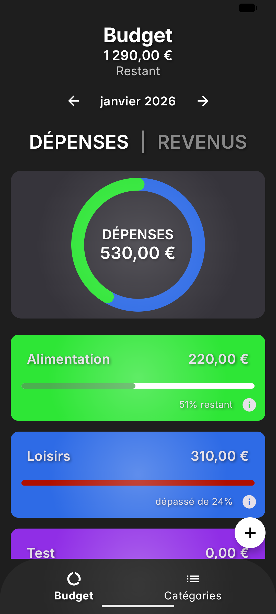
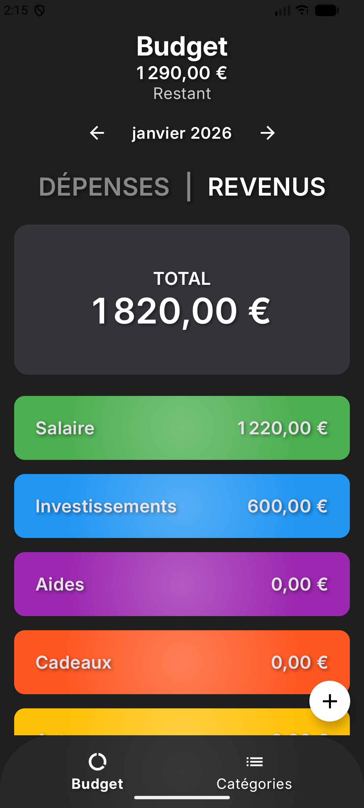
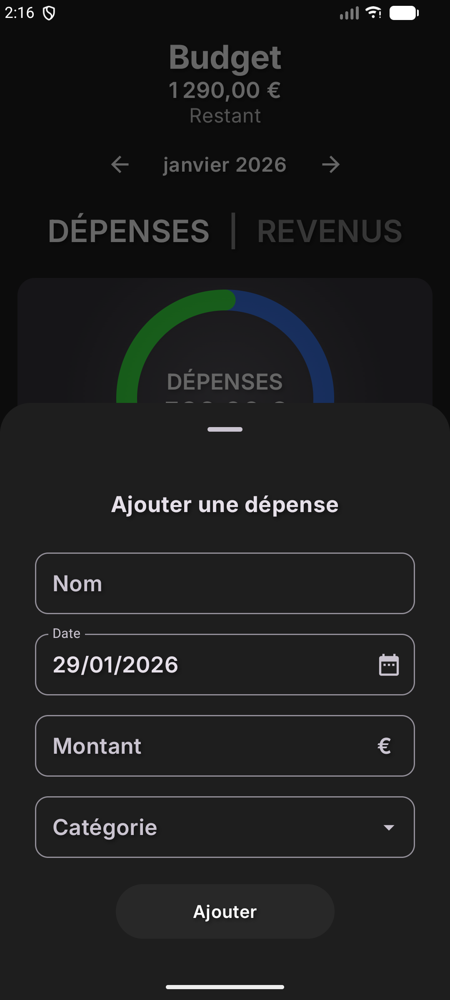
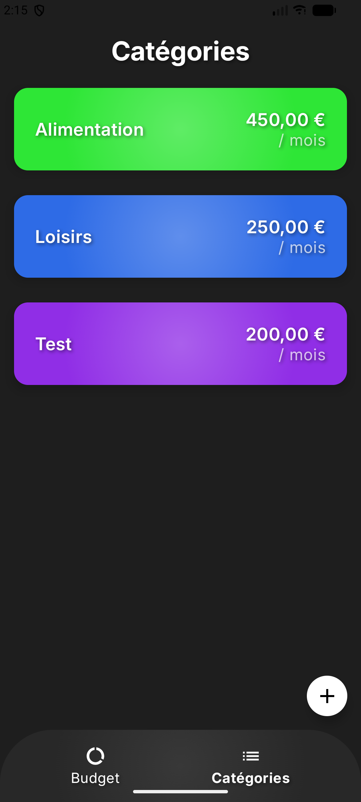
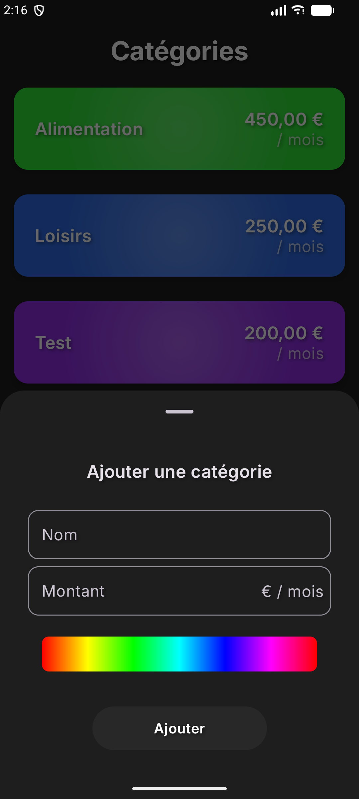

# Penny Wise

> Application Kotlin avec Jetpack Compose dédiée à la gestion de budget

## Contexte

### Objectifs

- Permettre de visualiser et de catégoriser ses dépenses  
- Aider à établir et à suivre un budget  
- Fournir des conseils ainsi que des statistiques  

### Fonctionnalités principales

- Suivi des dépenses : enregistrement des transactions et catégorisation  
- Création de budgets : configuration d’un budget global  
- Alertes de budget : indications visuelles en cas de dépassement du budget  

### Public cible

- Adultes recherchant un moyen simple et efficace de suivre leurs finances  
- Personnes souhaitant améliorer leurs habitudes d’épargne et leur gestion financière  

## Maquette

[🔗 Voir la maquette sur Figma](https://www.figma.com/design/nS5Mn78xMeGulZmcfafEhn/PennyWise?node-id=0-1&t=2MqqOZ3ymAXFFwHZ-1)

## Résultat final

## Résultat final

  
  
  

  
  
  

